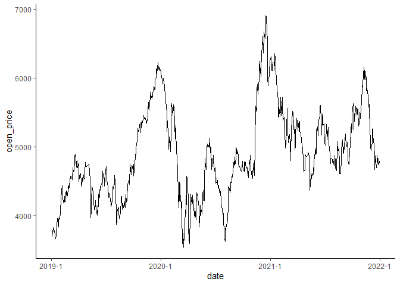

<!-- README.md is generated from README.Rmd. Please edit that file -->

# YahooFinance: Yahoo!ファイナンスの株価データのウェブスクレイピング

<!-- badges: start -->
<!-- badges: end -->

このパッケージはYahoo!ファイナンスの株価データをウェブスクレイピングするときに便利な関数を提供する。
このパッケージの特徴は以下の通り。

1.  JPXの公開データを用いて、企業名から銘柄コードを検索できる
2.  複数の銘柄コードもしくは企業名を指定することで、一つの関数で複数の企業の株価データを取得できる

ウェブスクレイピングの際に、[tidyverse/rvest](https://github.com/tidyverse/rvest)パッケージを使用する。

## インストール

このパッケージは[CRAN](https://CRAN.R-project.org)に登録していないので、
[GitHub](https://github.com/)からインストールする。

``` r
# install.packages("devtools")
devtools::install_github("KatoPachi/YahooFinance")
```

## 使い方

このパッケージで主に使用する関数は三つ

1.  `scrape_onefirm`: 1社分の株価データを取得する関数
2.  `scrape_more2firm`: 1社以上の株価データを同時に取得する関数
3.  `code_detect`: 企業名から銘柄コードを調べる関数

### 銘柄コードからスクレイピング

ソニーと任天堂の2014年上半期の月次単位の株価データを取得する例を示す。
取得したい株価データの期間は`start_date`・`end_date`引数を用いて”yyyymmdd”の形で指定する。

-   `start_date`: 取得期間の開始日
-   `end_date`: 取得期間の最終日

ここでは、`start_date = 20140101`と`end_date = 20140630`となる。

Yahoo!ファイナンスは日単位・週単位・月単位のデータを提供している。
データの種類は`datatype`引数で指定できる。

-   `datatype = "d"`: 日次株価データを取得できる
-   `datatype = "w"`: 週単位の株価データを取得できる
-   `datatype = "m"`: 月次株価データを取得できる

ここでは、`datatype = "m"`となる。

ソニーの銘柄コードは6758、任天堂の銘柄コードは7974である。
ここでは、二社の株価データを取得することを試みるので、`scrape_more2firm`を使う。

``` r
library(YahooFinance)

scrape_more2firm(
  c(6758, 7974),
  start_date = 20140101,
  end_date = 20140630,
  datatype = "m"
)
#> # A tibble: 12 x 8
#>    date       open_price high_price low_price close_price    volume
#>    <date>          <dbl>      <dbl>     <dbl>       <dbl>     <dbl>
#>  1 2014-06-02       1643       1738      1622        1682 162011200
#>  2 2014-05-01       1785       1817      1588        1627 222949000
#>  3 2014-04-01       1993       2030      1787        1792 217527200
#>  4 2014-03-03       1738       1985      1704        1972 262043800
#>  5 2014-02-03       1603       1797      1514        1780 274025200
#>  6 2014-01-06       1815       1920      1609        1626 273398500
#>  7 2014-06-02      11775      12595     11380       12125  12380900
#>  8 2014-05-01      10685      11940     10070       11770  13270400
#>  9 2014-04-01      12340      12350     10610       10740  11923600
#> 10 2014-03-03      12355      12875     11360       12260  16621700
#> 11 2014-02-03      11985      13185     11215       12555  27340900
#> 12 2014-01-06      14000      16150     11935       12150  51986300
#> # ... with 2 more variables: split_up_adjust_close_price <dbl>, brand <dbl>
```

取得されたデータの詳細は以下の通り

-   `date`: 日付
-   `open_price`: 始値
-   `high_price`: 高値
-   `low_price`: 安値
-   `close_price`: 終値
-   `volume`: 出来高
-   `split_up_adjust_close_price`:
    調整後終値。詳細は[Yahoo!ファイナンスのヘルプセンター](https://support.yahoo-net.jp/PccFinance/s/article/H000006678)で確認すること。
-   `brand`: 銘柄コード

`append = FALSE`を引数に加えると、銘柄別にデータを取得することもできる。

``` r
sepdt <- scrape_more2firm(
  c(6758, 7974),
  start_date = 20140101,
  end_date = 20140630,
  datatype = "m",
  append = FALSE
)
```

各銘柄のデータは`sepdt$b(銘柄コード)`で取り出せる。
たとえば、ソニーの銘柄コードは6758なので、`sepdt$b6758`でソニーの株価データを取り出せる

``` r
sepdt$b6758
#> # A tibble: 6 x 8
#>   date       open_price high_price low_price close_price volume split_up_adjust~
#>   <date>          <dbl>      <dbl>     <dbl>       <dbl>  <dbl>            <dbl>
#> 1 2014-06-02       1643       1738      1622        1682 1.62e8             1682
#> 2 2014-05-01       1785       1817      1588        1627 2.23e8             1627
#> 3 2014-04-01       1993       2030      1787        1792 2.18e8             1792
#> 4 2014-03-03       1738       1985      1704        1972 2.62e8             1972
#> 5 2014-02-03       1603       1797      1514        1780 2.74e8             1780
#> 6 2014-01-06       1815       1920      1609        1626 2.73e8             1626
#> # ... with 1 more variable: brand <dbl>
```

`scrape_more2firm`は`scrape_onefirm`をfor
loop構文で繰り返し処理をしているだけなので、
1社だけの株価データもスクレピングできる。

``` r
scrape_more2firm(
  6758,
  start_date = 20140101,
  end_date = 20140630,
  datatype = "m"
)
#> # A tibble: 6 x 8
#>   date       open_price high_price low_price close_price volume split_up_adjust~
#>   <date>          <dbl>      <dbl>     <dbl>       <dbl>  <dbl>            <dbl>
#> 1 2014-06-02       1643       1738      1622        1682 1.62e8             1682
#> 2 2014-05-01       1785       1817      1588        1627 2.23e8             1627
#> 3 2014-04-01       1993       2030      1787        1792 2.18e8             1792
#> 4 2014-03-03       1738       1985      1704        1972 2.62e8             1972
#> 5 2014-02-03       1603       1797      1514        1780 2.74e8             1780
#> 6 2014-01-06       1815       1920      1609        1626 2.73e8             1626
#> # ... with 1 more variable: brand <dbl>
```

これは、`scrape_onefirm`と同じ結果となる。

``` r
scrape_onefirm(
  6758,
  start_date = 20140101,
  end_date = 20140630,
  datatype = "m"
)
#> # A tibble: 6 x 8
#>   date       open_price high_price low_price close_price volume split_up_adjust~
#>   <date>          <dbl>      <dbl>     <dbl>       <dbl>  <dbl>            <dbl>
#> 1 2014-06-02       1643       1738      1622        1682 1.62e8             1682
#> 2 2014-05-01       1785       1817      1588        1627 2.23e8             1627
#> 3 2014-04-01       1993       2030      1787        1792 2.18e8             1792
#> 4 2014-03-03       1738       1985      1704        1972 2.62e8             1972
#> 5 2014-02-03       1603       1797      1514        1780 2.74e8             1780
#> 6 2014-01-06       1815       1920      1609        1626 2.73e8             1626
#> # ... with 1 more variable: brand <dbl>
```

### 企業名からスクレイピング

`scrape_more2firm`は企業名を指定する`name`引数を備えている。
この引数を指定してスクレイピングする場合、`scrape_more2firm`は以下のようなプロセスを実行する。

1.  `code_detect`関数を使って、銘柄コードを検索する
2.  `scrape_onefirm`関数の繰り返し処理

`code_detect`関数は`name`引数で指定した企業名と部分的に一致する企業を
[JPXの公開データ](https://www.jpx.co.jp/markets/statistics-equities/misc/01.html)から探し、
部分マッチした企業の銘柄コードを返す関数である。

``` r
find <- code_detect(c("ソニー", "任天堂"))
find$code
#> ソニーグループ         任天堂 
#>           6758           7974
```

企業名から正しく銘柄コードを発見出来ていることがわかる。
また、`find$info`でマッチしたデータを確認できる。
さらに、JPXの公開データは`data(BrandCode)`で確認できる。

`name`引数を用いたスクレイピングは以下のコードで実行できる。

``` r
scrape_more2firm(
  name = c("ソニー", "任天堂"),
  start_date = 20140101,
  end_date = 20140630,
  datatype = "m"
)
#> # A tibble: 12 x 8
#>    date       open_price high_price low_price close_price    volume
#>    <date>          <dbl>      <dbl>     <dbl>       <dbl>     <dbl>
#>  1 2014-06-02       1643       1738      1622        1682 162011200
#>  2 2014-05-01       1785       1817      1588        1627 222949000
#>  3 2014-04-01       1993       2030      1787        1792 217527200
#>  4 2014-03-03       1738       1985      1704        1972 262043800
#>  5 2014-02-03       1603       1797      1514        1780 274025200
#>  6 2014-01-06       1815       1920      1609        1626 273398500
#>  7 2014-06-02      11775      12595     11380       12125  12380900
#>  8 2014-05-01      10685      11940     10070       11770  13270400
#>  9 2014-04-01      12340      12350     10610       10740  11923600
#> 10 2014-03-03      12355      12875     11360       12260  16621700
#> 11 2014-02-03      11985      13185     11215       12555  27340900
#> 12 2014-01-06      14000      16150     11935       12150  51986300
#> # ... with 2 more variables: split_up_adjust_close_price <dbl>, brand <dbl>
```

`name`引数を指定したとき、銘柄コードを指定する必要はない。
仮に企業名と銘柄コードを同時に指定したならば、**企業名が優先される**ことに注意されたい。

``` r
scrape_more2firm(
  c(6785, 7947),
  name = c("ソニー", "任天堂"),
  start_date = 20140101,
  end_date = 20140630,
  datatype = "m"
)
#> # A tibble: 12 x 8
#>    date       open_price high_price low_price close_price    volume
#>    <date>          <dbl>      <dbl>     <dbl>       <dbl>     <dbl>
#>  1 2014-06-02       1643       1738      1622        1682 162011200
#>  2 2014-05-01       1785       1817      1588        1627 222949000
#>  3 2014-04-01       1993       2030      1787        1792 217527200
#>  4 2014-03-03       1738       1985      1704        1972 262043800
#>  5 2014-02-03       1603       1797      1514        1780 274025200
#>  6 2014-01-06       1815       1920      1609        1626 273398500
#>  7 2014-06-02      11775      12595     11380       12125  12380900
#>  8 2014-05-01      10685      11940     10070       11770  13270400
#>  9 2014-04-01      12340      12350     10610       10740  11923600
#> 10 2014-03-03      12355      12875     11360       12260  16621700
#> 11 2014-02-03      11985      13185     11215       12555  27340900
#> 12 2014-01-06      14000      16150     11935       12150  51986300
#> # ... with 2 more variables: split_up_adjust_close_price <dbl>, brand <dbl>
```

企業名が1つである場合、`scrape_more2firm`と`scrape_onefirm`の両方を使用できる。

``` r
scrape_more2firm(
  name = "ソニー",
  start_date = 20140101,
  end_date = 20140630,
  datatype = "m"
)
#> # A tibble: 6 x 8
#>   date       open_price high_price low_price close_price volume split_up_adjust~
#>   <date>          <dbl>      <dbl>     <dbl>       <dbl>  <dbl>            <dbl>
#> 1 2014-06-02       1643       1738      1622        1682 1.62e8             1682
#> 2 2014-05-01       1785       1817      1588        1627 2.23e8             1627
#> 3 2014-04-01       1993       2030      1787        1792 2.18e8             1792
#> 4 2014-03-03       1738       1985      1704        1972 2.62e8             1972
#> 5 2014-02-03       1603       1797      1514        1780 2.74e8             1780
#> 6 2014-01-06       1815       1920      1609        1626 2.73e8             1626
#> # ... with 1 more variable: brand <dbl>
```

### 使用例

日本空港ビルデングの2019年\~2021年の日次株価データを取得し、始値の時系列データをプロットしてみる。

``` r
dt <- scrape_more2firm(
  name = "日本空港ビルデング",
  start_date = 20190101,
  end_date = 20211231,
  datatype = "d"
)

library(ggplot2)

ggplot(dt, aes(x = date, y = open_price)) +
  geom_line() +
  scale_x_date(date_labels = "%Y-%b") +
  theme_classic()
```



### スクレイピングは時間がかかる

注意したいことは、スクレイピングは時間がかかるという点である。
なぜなら、スクレイピングする必要があるページ数が増えるほど、 for
loopによる繰り返し処理の時間がかかるからである。
例として、さきほどの例のスクレイピングの実行時間を記しておく。
経過という名前の時間がコマンドの起動から終了までに要した時間であり、
単位は秒。

``` r
system.time(
  dt <- scrape_more2firm(
    name = "日本空港ビルデング",
    start_date = 20190101,
    end_date = 20211231,
    datatype = "d"
  )
)
#>    ユーザ   システム       経過  
#>       1.62       0.14      49.41
```
